# Shahzeb Siddiqui

  

# Bio

Shahzeb Siddiqui is a HPC Consultant/Software Integration Specialist at [Lawrence Berkeley National Laboratory](https://www.lbl.gov/) at [NERSC](http://nersc.gov/). He is part of [**User Engagement Team**](https://www.nersc.gov/about/nersc-staff/user-engagement/) that is responsible for engaging with NERSC user community through user support tickets, user outreach, training, documentation. Shahzeb is part of the [Exascale Computing Project](https://www.exascaleproject.org/)(ECP) in [Software Deployment](https://www.exascaleproject.org/research-group/software-deployment-at-the-facilities/) (SD) group
where he is responsible for building Spack [Extreme-Scale Scientific Software Stack (E4S)](https://e4s-project.github.io/) at the DOE facilities.

Shahzeb is the creator of [buildtest](https://github.com/buildtesters/buildtest) an HPC testing framework to automate build and execution of tests. Shahzed created [lmodule](https://github.com/buildtesters/lmodule), a Python API for module system which is a spin-off from buildtest project and it is a standalone API that can be used for testing modules. 

Shahzeb created slurm utility called [jobstats](https://github.com/shahzebsiddiqui/jobstats) which is a wrapper to `sacct` and `sreport` to show slurm job details. 

  
    

 

 

# Experience

Shahzeb has experience installing and managing large software stack, cluster manager ([Bright Cluster Manager](https://www.nvidia.com/en-us/data-center/bright-cluster-manager/), [Cobbler](https://cobbler.github.io/)), configuration management ([Ansible](https://www.ansible.com/)), GPFS,
[Slurm](https://slurm.schedmd.com/documentation.html) and LSF. Shahzeb is an experienced Developer, Dev-Ops, System Administrator and often involved in open-source projects.

Shahzeb Siddiqui started out his career in High Performance Computing (HPC) in 2012 at [King Abdullah University of Science and Technology (KAUST)](https://www.kaust.edu.sa/en)
while pursuing his Masters. His focus in HPC includes Parallel Programming, Performance Tuning, Containers ([Singularity](https://apptainer.org/user-docs/master/index.html#), [Docker](https://www.docker.com/)),
Linux system administration, Scientific Software Installation and testing, Scheduler Optimization, and Job Metrics.
Shahzeb has held multiple roles in his HPC career in the following companies: Dassault-Systemes, Pfizer, Penn State, and IBM.
Prior to 2012, he was a software engineer holding multiple roles at Global Science & Technology, Northrop Grumman, and Penn State.

ORCID: https://orcid.org/0000-0002-2342-6974

# Education

- M.S Computer Science at [KAUST](https://www.kaust.edu.sa/en) (08/2012 - 12/2013)
- B.S Computer Engineer at [Penn State University](https://www.psu.edu/) (08/2008 - 05/2011)

Certification
--------------

- Red Hat Certified System Administrator (RHCSA) -  Credential ID: [200-019-677](https://rhtapps.redhat.com/verify?certId=200-019-677)

Technology Stack
-----------------

| Topics                   | Tools                                                                                                                            |
|--------------------------|----------------------------------------------------------------------------------------------------------------------------------|
| Cluster Manager          | Bright Cluster Manager, Cobbler                                                                                                  |
| Scheduler                | SLURM, LSF                                                                                                                       |
| Containers               | Singularity, Docker, Docker swarm, Kubernettes                                                                                   |
| Configuration Management | Ansible                                                                                                                          |
| Build Framework          | Easybuild, Spack, OpenHPC                                                                                                        |
| Programming              | Distributed Computing, GPU Computing, Parallel Computing, C, C++, Python, JAVA, PHP, CSS, HTML, Javascript, ColdFusion, TCL, Lua |
| Database                 | MySQL, mariadb                                                                                                                   |
| DevOps Tools             | Jenkins, Git, Gitlab, Artifactory                                                                                                |
| Module Environment       | Lmod, EnvironmentModules                                                                                                         |
| Ticketing System         | JIRA, JIRA Service Desk, ServiceNow                                                                                              |
| Misc                     | Restructured Text, Markdown, Shell Scripting, Cyber-security, Computer Architecture                                              |

## Conferences

### 2023

- [**Facility Testing of E4S at NERSC**](https://docs.google.com/presentation/d/1r_uXKvjpz84s5TmkDczfBep8DXNP2vEs/edit) at [ECP Community BoF 2023](https://www.exascaleproject.org/event/2023-ecp-community-bof-days/) on Enhancing Confidence in a Software Ecosystem through Complimentary Layers of Software Testing, Feb 15th 2023
- [**E4S at OLCF, ALCF, and NERSC**](https://docs.google.com/presentation/d/1wbZsNx6LQvPfZMc7abB_hbZm8A95c3oa/edit?usp=sharing&ouid=102126664227037583807&rtpof=true&sd=true) at [ECP Community BoF 2023](https://www.exascaleproject.org/event/2023-ecp-community-bof-days/), Feb 14th 2023 
- [**Automated Acceptance Testing in HPC with buildtest**](https://drive.google.com/file/d/1CnPH3Ct_YF8H7bLHx0X84TMf3mu_HKBz/view?usp=share_link) at ECP Project Tutorial 2023, Feb 7th 2023, [Video](https://youtu.be/YxOm6aiDy3E) 
### 2022
- [**An Automated Approach to Continuous Acceptance Testing of HPC Systems at NERSC**](https://drive.google.com/file/d/1BLJ0pfMBc3ZTitVIA6VGRDAZdI4gBBul/view) at [HPCSYSPRO22](https://sc22.supercomputing.org/session/?sess=sess463), Nov 14th 2022 
- [**New User Training**](https://www.nersc.gov/users/training/events/new-user-training-sept2022/), Sep 28th 2022
- [**E4S at NERSC 2022**](https://www.nersc.gov/users/training/events/e4s-at-nersc-2022/), Aug 25th 2022
- [**MVAPICH2 at NERSC**](https://docs.google.com/presentation/d/1aYMbitopEGJcnxpbQpiSOcfZlfQgH3gJ/edit?rtpof=true), Aug 24th 2022 at [MVAPICH User Group Meeting 2022](http://mug.mvapich.cse.ohio-state.edu/program/), [*Video*](https://www.youtube.com/watch?v=IDdupGfF16g) 
- [**Facility Deployment of E4S at ALCF, OLCF, and NERSC**](https://drive.google.com/file/d/1FBdN3AuEaJr3J0j_ZMZR3agTmk9jeIJU/view?usp=share_link), May 3rd 2022 at ECP Annual Meeting 2022
- [**Spack Infrastructure at NERSC**](https://docs.google.com/presentation/d/1nKEvgwCh4i8c3l9i_35BLv9NnRl4tsRw/edit?usp=sharing&ouid=102126664227037583807&rtpof=true&sd=true), April 5th 2022 at [SEA Improving Scientific Software Conference 2022](https://sea.ucar.edu/conference/2022)

### 2021

- [**Lmod User Training**](https://www.nersc.gov/users/training/events/lmod-user-training/), June 22 2021
- [**HPC System Test: Building a cross-center collaboration for system testing**](https://github.com/olcf/hpc-system-test-wg/blob/master/events/cug2021bof.md), May 6th 2021 at Cray User Group 2021 BOF
- [**HPC System and Software testing via buildtest**](https://drive.google.com/file/d/134bZIWyp0AL60I1bW4oWywCYW0oV8ckB/view?usp=sharing) at [ECP Annual Meeting 2021](https://whova.com/portal/webapp/ecpan_202104/Agenda/1511107), April 15th 2021
- [**Spack E4S Facility Pipeline Update**](https://docs.google.com/presentation/d/1VBIoHyQnvRkU7SQPLzzFuigt4FcarCfC/edit?usp=sharing&ouid=102126664227037583807&rtpof=true&sd=true) at [ECP Annual Meeting 2021](https://whova.com/portal/webapp/ecpan_202104/Agenda/1511089), April 14th 2021
- **Acceptance Test with Buildtest for Cori System** at [High Performance Computing Benchmarking and Optimization (HPBench20)](http://hpcs2020.cisedu.info/4-program), Mar 27th 2021
- **Acceptance Test with buildtest and Cori Testsuite** at [SEA's Improving Scientific Software Conference and Tutorials 2021](https://sea.ucar.edu/conference/2021), Mar 23rd 2021
- Panel moderator for [Benchmarking in the Data Center: Expanding to the Cloud](https://parallel.computer/index.html) at [Principles and Practice of Parallel Programming (PPoPP) 2021](https://ppopp21.sigplan.org/), Feb 28th 2021
- [**buildtest: HPC Testing Framework for Acceptance Testing**](https://fosdem.org/2021/schedule/event/buildtest/) at [FOSDEM21 HPC, Big Data and Data Science devroom](https://fosdem.org/2021/schedule/track/hpc_big_data_and_data_science/), Feb 7th 2021
- [**buildtest: Testing Framework for HPC systems**](https://easybuild.io/eum/022_eum21_buildtest.pdf) at [EasyBuild User Meeting 2021](https://easybuild.io/eum/), Jan 29th, 2021
- [**Automate Module Testing with Lmodule**](https://easybuild.io/eum/023_eum21_Lmodule.pdf) at [EasyBuild User Meeting 2021](https://easybuild.io/eum/) on Jan 29th, 2021

### 2020

- [**Spack Community BoF**](https://sc20.supercomputing.org/presentation/?id=bof107&sess=sess310) at SC20, Nov 18, 2020.
- [**Buildtest: HPC Software Stack Testing Framework**](https://archive.fosdem.org/2020/schedule/event/buildtest/) at [FOSDEM'20 HPC Big Data and Data Science devroom](https://archive.fosdem.org/2020/schedule/track/hpc_big_data_and_data_science/), Feb 1-2, 2020
- [**Building an Easybuild Container Library in Sylabs Cloud**](https://users.ugent.be/~kehoste/eum20/eum20_02_shahzeb_easybuild_container_library.pdf) at [5th Easybuild User Meeting](https://github.com/easybuilders/easybuild/wiki/5th-EasyBuild-User-Meeting), Jan 29-31, 2020
- [**buildtest: HPC Software Stack Testing Framework**](https://users.ugent.be/~kehoste/eum20/eum20_05_shahzeb_buildtest.pdf) at [5th Easybuild User Meeting](https://github.com/easybuilders/easybuild/wiki/5th-EasyBuild-User-Meeting), Jan 29-31, 2020

### Prior to 2020

- [**Buildtest: A Software Testing Framework with Module Operations for HPC systems**](https://sc19.supercomputing.org/presentation/?id=ws_hust103&sess=sess116) at SC'19 in [HPC User Support Tools Workshop](https://hust-workshop.github.io/), Nov 18, 2019
- [**Software Stack Testing with buildtest**](https://hpckp.org/past-edition/hpckp-18/#software-stack-testing-with-buildtest) at [HPCKP'18](https://hpckp.org/past-edition/hpckp-18/), June 21-22, 2018
- [**HPC Application Testing Framework - buildtest**](https://hpckp.org/wp-content/uploads/2020/05/11-HPCKP17-Shahzeb-Siddiqui.pdf) at  [HPCKP'17](https://hpckp.org/past-edition/hpckp-17/), June 15-16, 2017

## Publications

- Siddiqui, Shahzeb, & Shende, Sameer. **[Software Deployment Process at NERSC: Deploying the Extreme-scale Scientific Software Stack (E4S) Using Spack at the National Energy Research Scientific Computing Center (NERSC)](https://www.osti.gov/biblio/1868332-software-deployment-process-nersc-deploying-extreme-scale-scientific-software-stack-e4s-using-spack-national-energy-research-scientific-computing-center-nersc)**, 2022-05-17, https://doi.org/10.2172/1868332
- Shahzeb Siddiqui, **Buildtest: A Software Testing Framework with Module Operations for HPC Systems**, HUST, Springer, March 25, 2020, https://doi.org/10.1007/978-3-030-44728-1_1
- Shahzeb Siddiqui, Fatemah AlZayer, Saber Feki, **Historic Learning Approach for Auto-tuning OpenACC Accelerated Scientific Applications**, VECPAR, Springer, December 7, 2019, https://doi.org/10.1007/978-3-319-17353-5_19
- Shahzeb Siddiqui, **Automatic Performance Tuning of Parallel and Accelerated Seismic Imaging Kernels**, EAGE Workshop on High Performance Computing for Upstream, European Association of Geoscientists & Engineer, September 1, 2014, https://doi.org/10.3997/2214-4609.20141941
